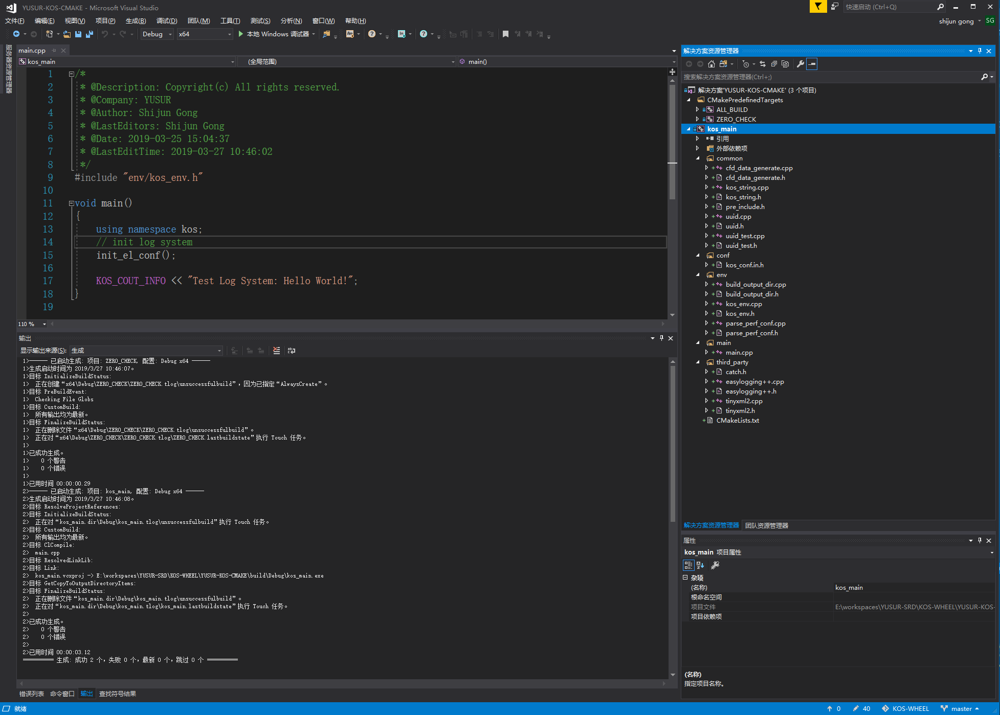
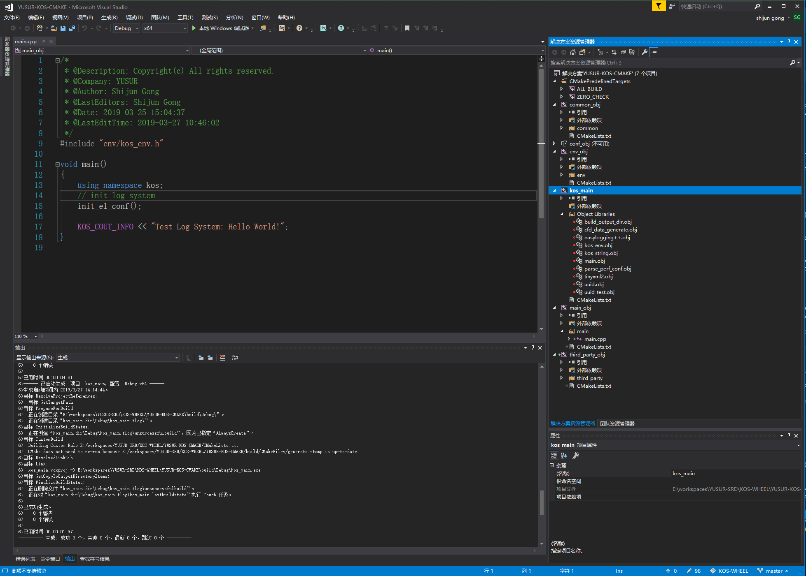
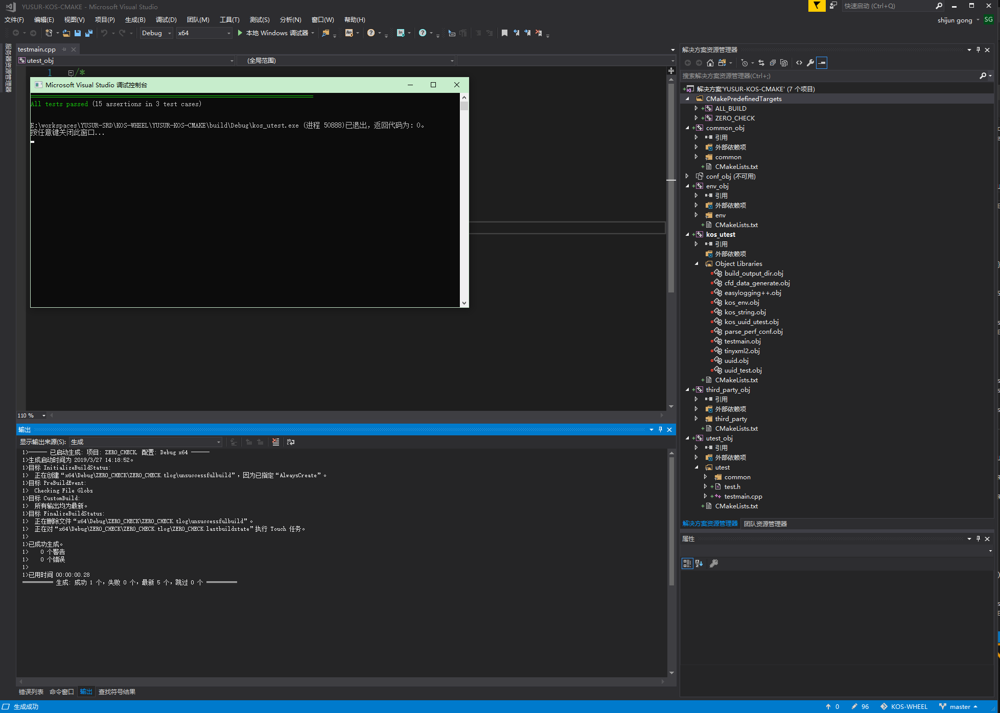

<!--
 * @Description: Copyright(c) All rights reserved.
 * @Company: YUSUR
 * @Author: Shijun Gong
 * @Date: 2020-06-21 07:36:28
 * @LastEditors: Shijun Gong
 * @LastEditTime: 2020-06-21 07:54:02
--> 
# cmake_build_cxx
这个项目，主要记录本人这四天来学习cmake构建系统的经历
### using cmake build a big project. The project contain nultilevel directory and resource files. This project contain two ways to build project. One, build all project from sources. Two, build all project from objects. if there is any mistake, please give me your advice.  

## 项目需求：
一个大型工程，工程需要包括多级目录结构，需要有主程序以及单元测试，以及一些资源文件用来进行项目配置。除此之外，单元测试和主程序之间，构成可选项。也就是说，要么进行单元测试，要么运行主程序。 另外，处于个人爱好，比较喜欢在vs中开发代码，因此需要在vs显示的构建虚拟工程目录。  
### 需要说明的一点：
由于大型工程，不同目录之间存在相互引用，以及引用顺序不方便确认的情况，因此，本工程提供了两种构建方式。第一，源文件构建，将所有源文件，放在一起进行构建，这样可以方便在vs一个工程中，进行查看与调试。第二， 目标文件构建，先将不同目录下的源文件，生成对应的目标文件，再进行构建。

### 项目效果如下图
配置： 可以通过设置下面两个参数来选择，是构建单元测试，还是主程序，以及采用object方式，还是源程序。  
配置选项，在根目录`option.txt`文件中  
`option (UNIT_TEST_ENABLE "Enable KOS unit test" OFF)`  
`option (OBJECT_BUILD_ENABLE "Enable build from object" OFF)`  

主程序，使用源文件构建，效果如下图：  

主程序，使用OBJ构建，效果如下图：

单元测试，使用OBJ构建，效果如下图：

### 接下来，介绍主要的CMakeList.txt 文件
在采用OBJ方式构建的时候，不同目录下面的cmake文件是一样的，因此，我们只介绍两个cmake文件。一个主cmake文件，和一个目录cmake文件。同时，在采用源文件构建时，目录cmake是不起作用的。  

[主cmake文件详解](doc/main_cmake.md)  
[目录下cmake文件详解](doc/dir_cmake.md)

此外，`option.txt`对应的`kos_conf.in.h`对应的文件，我们放在根目录的conf目录下面，build之后对应的`kos_conf.h`则放在相应的build目录下面的`conf`文件夹中。

## 申明
本项目使用了开源库**catch2**单元测试，**easylogging++**日志系统，以及**tinyxml2**xml解析工具。特此申明，感谢开源者，都是很好用的开源库，只需要添加对应的头文件或者源文件到工程中就可以了。
